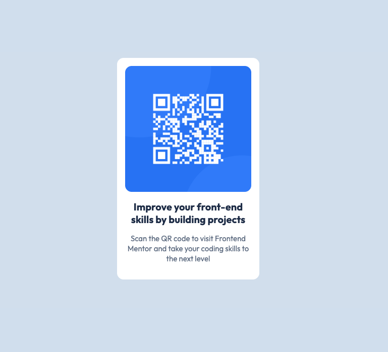

# QR Code Component

### Description

This is a foundational Frontend Mentor challenge using HTML and CSS.
The project helps to practice translating Figma designs into HTML and CSS.

### What I learned

This project was based on a Frontend Mentor challenge, and I followed the provided README and style-guide closely. By following their design details - such as the colors, fonts and layout, I kept the look consistent with the original and accurately built it using HTML and CSS.

### Resources

W3schools, MDN, W3docs

